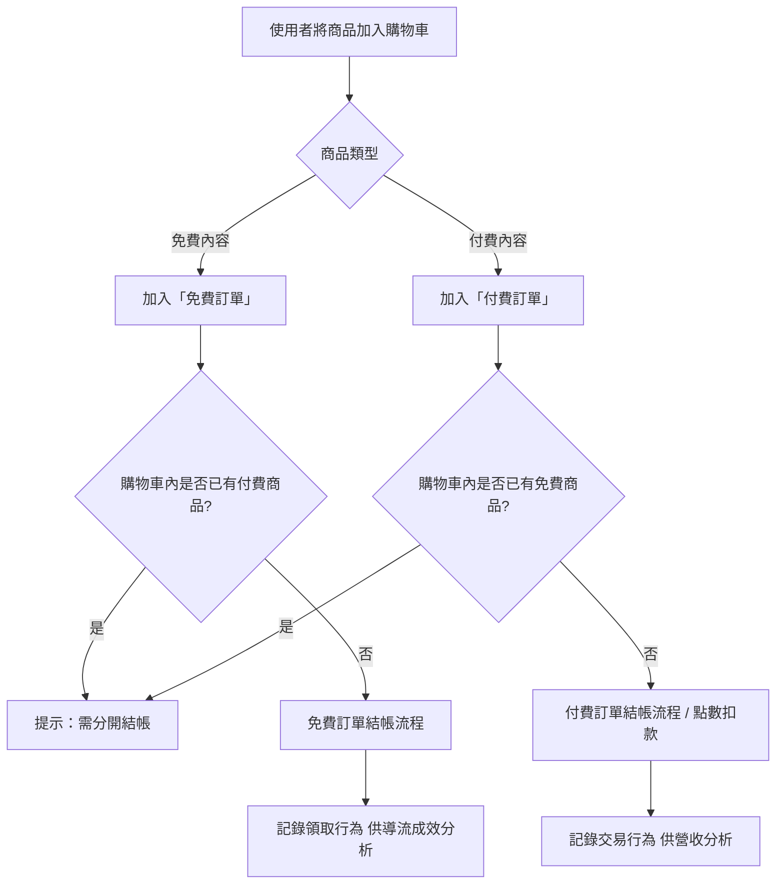

# 雙軌購物車設計 Dual-Track Cart Design

> 本文件為產品規劃期間的規格文件之一，完整專案背景請見[根目錄 README](../README.md)

## 背景與問題

本專案採用[雙軌商業模式](../business-model-design)，同時提供免費內容（用於導流）與付費內容（主要營收來源）。由於付費內容採用點數消費，而點數與新台幣並非 1:1 兌換的折抵關係，若讓免費與付費商品混合在同一張訂單中結帳，會讓「這筆訂單到底扣了多少點數／該付多少錢」變得難以清楚呈現，也增加後續對帳的複雜度。

同時，即便是免費內容，也需要讓使用者走過完整的結帳流程——這樣才能確保使用者行為數據（瀏覽→加入購物車→完成領取）的一致性，作為後續分析內容導流成效的依據。

## 目標與成功指標

- **體驗一致性**：無論免費或付費商品，使用者在購物車與結帳介面的操作方式應盡量一致，不因商品類型不同而產生認知負擔
- **邏輯清晰性**：後端需明確區分免費／付費訂單，避免點數與金流邏輯混淆導致對帳錯誤
- **數據可追蹤性**：免費內容的「結帳」行為需被完整記錄，作為導流成效評估的依據

## 使用者情境

> 作為一位使用者，我希望能將免費筆記加入購物車並完成「領取」，操作方式跟購買付費筆記一樣直覺，不需要學習兩套不同的流程。

> 作為一位使用者，當我同時想要一份免費筆記與一份付費筆記時，我希望系統能清楚告訴我這是兩筆不同的交易，而不是讓我誤以為點數可以折抵免費商品，或搞不清楚實際扣了多少點數。

## 規格邏輯

核心規則：**同一張訂單不可同時包含免費與付費商品**。使用者加入購物車時，系統依商品類型自動分流；若購物車內已有付費商品，加入免費商品時會觸發提示，引導使用者分開結帳。

- 前端呈現上，免費與付費商品仍可同時顯示在同一個購物車介面，維持視覺一致性；分流判斷發生在「結帳」這個動作觸發時，而非商品加入購物車時，盡量減少對使用者操作的干擾
- 結帳流程依訂單類型分別導向「免費領取」或「點數扣款」兩條路徑，各自完成後產生獨立的訂單紀錄

## 取捨與限制

- **曾考慮的替代方案**：允許混合訂單，付費部分照實際金額結算、免費部分標示為NT$0——捨棄原因是點數與新台幣非1:1折抵，混合呈現容易讓使用者誤解實際扣款邏輯，也增加對帳與客服處理的複雜度
- **已知限制**：使用者若同時想要免費與付費商品，需經過兩次結帳流程，體驗上比單一訂單多一個步驟；目前優先考慮邏輯清晰與對帳正確性，作為冷啟動階段的取捨