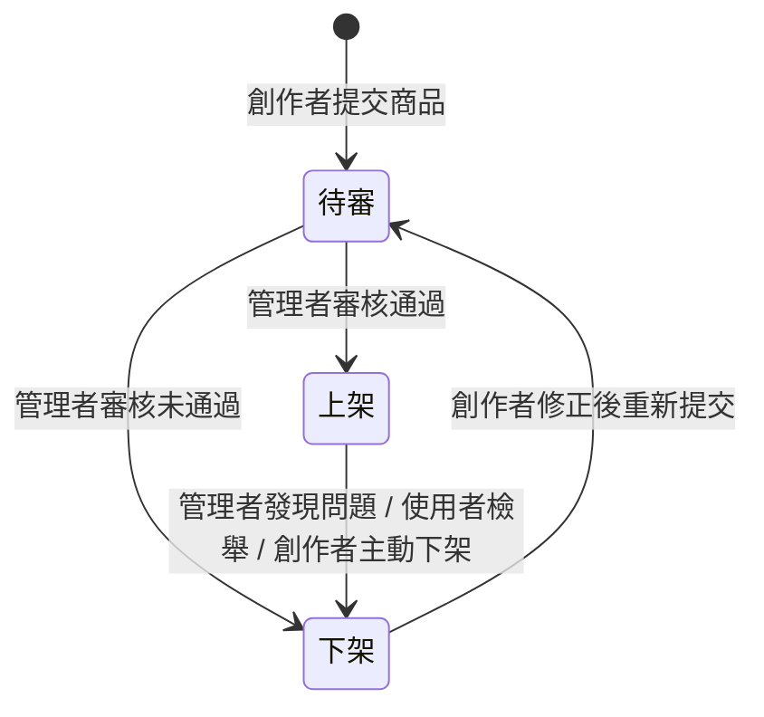

# 商品審核狀態流程設計 Content Review Workflow

> 本文件為產品規劃期間的規格文件之一，完整專案背景請見[根目錄 README](../README.md)

## 背景與問題

本專案作為內容電商平台，創作者可自行將筆記／教材上架為商品。若沒有審核機制，平台內容品質無法控管，可能出現格式錯誤、內容不完整、甚至誤植他人著作的商品，直接影響使用者信任與平台聲譽。

但審核機制若設計過重（例如需要人工逐一詳細審閱），會拖慢上架速度，降低創作者的上架意願，與雙軌商業模式中「加速內容成長」的目標互相牴觸。因此需要一套能在「品質可控」與「上架效率」之間取得平衡的審核流程。

## 目標與成功指標

- **品質控管**：確保上架商品符合基本格式與內容完整性要求，降低使用者踩雷機率
- **流程效率**：審核不應成為創作者上架的主要阻力，需明確定義審核時效與觸發下架的條件
- **可控性**：平台需保有隨時將問題商品下架的能力，而不影響其他正常商品的呈現

## 使用者情境

> 作為一位內容創作者，我希望上架商品後能清楚知道目前的審核狀態，不需要透過客服詢問才能得知進度，並且我可以自行選擇上架或下架商品。

> 作為一位使用者，我希望我購買的商品是經過平台基本把關的，不會買到格式錯亂或內容不符描述的筆記。

> 作為平台管理者，我希望能在發現問題商品（例如版權疑慮、內容不當）時，快速將其下架，且這個動作不影響其他商品的正常運作。

## 規格邏輯

商品狀態分為三個核心狀態：**待審、上架、下架**，狀態轉換由不同角色觸發：

- **待審**：商品剛提交或修正後重新提交，尚未對一般使用者開放購買
- **上架**：通過審核，對所有使用者可見且可購買
- **下架**：可能來自審核未通過、管理者主動處理、創作者自行下架，或使用者檢舉觸發覆核；下架商品保留給創作者修正機會，而非直接刪除，降低創作者因單次失誤而完全喪失商品的挫折感
- 審核標準聚焦在「格式完整性」與「基本內容合規性」（例如是否為原創、格式是否可正常閱讀），不涉及主觀的教學品質評分，避免審核標準模糊化拖慢流程

## 取捨與限制

- **曾考慮的替代方案**：無審核機制，上架即公開的自由市場(某些競品即使用這個角度)，僅靠使用者檢舉事後處理——捨棄原因是教育內容涉及使用者實際付費購買，若完全仰賴事後檢舉，前期容易累積品質不佳的商品，損害平台初期建立信任的關鍵階段

- **已知限制**：目前審核仍需人工執行，已有完整審核通知流程。隨著上架商品數量成長，審核可能成為流程瓶頸，是後續可考慮導入自動化檢查（如格式完整性自動偵測）的方向
