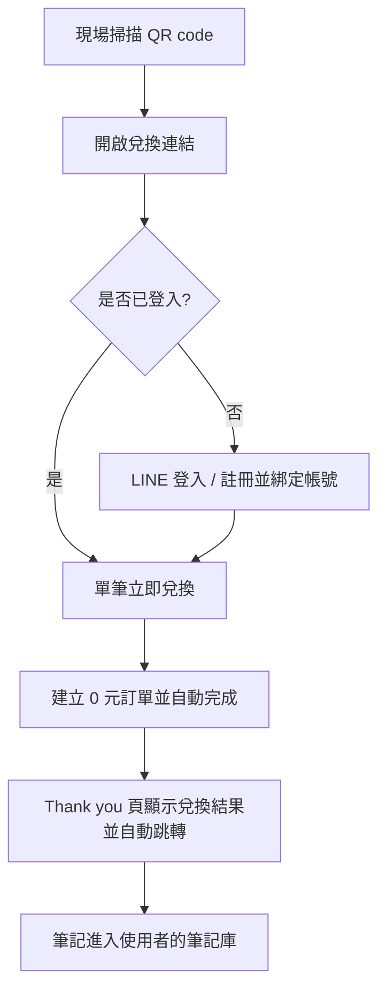

# 活動 QR 兌換與 LINE 綁定流程 LINE Claim Flow

> 相關文件：[點數購物車](points-cart.md)、[雙軌購物車設計](dual-track-cart.md)、[問題與使用者](../overview/problem-and-users.md)

## 一句話說明

讓演講、工作坊現場的聽眾掃描 QR code，就能在同一個流程內完成註冊、綁定 LINE，並領取講者的筆記。

## 1. 問題與使用者

- **使用者**：講者（KOL）的現場聽眾；需要推廣工具的講者與行銷團隊。
- **痛點**：聽眾現場想立刻拿到筆記，但註冊、綁定 LINE 的步驟太多，容易在中途流失。
- **為什麼要綁 LINE**：降低註冊門檻、官方帳號行銷管道拓展。
- **目標**：把「掃碼到拿到筆記」的步驟降到毫無摩擦力，手機平板都能順利使用。

## 2. 產品決策

- **用 QR code 兌換連結，而不是讓聽眾自己到平台搜尋**：講者在現場展示，掃碼即進入領取頁。
- **註冊與 LINE 綁定合併進領取流程**：不讓聽眾先註冊、再綁定、再找筆記，目標是毫無摩擦。
- **單筆立即兌換，不經過購物車**：活動場景只領一本。
- **領取仍建立 0 元訂單並自動完成**：即使是免費筆記，也留下完整紀錄，才能分析導流成效（見 `dual-track-cart.md`）。
- **新會員註冊贈送 50 點**：能夠看到更多筆記的基本贈送點數，增加回流概率。
- **提供後台解除 LINE 綁定的功能**：處理例如綁錯帳號的情境，會交由NoteX LINE客服處理。

### 情境與邊界處理

| 情境 | 處理方式 |
|---|---|
| 尚未登入的新使用者 | LINE 登入並自動註冊、完成綁定後直接領取 |
| 已登入的既有會員 | 直接領取並到達筆記閱讀入口 |
| 已經擁有這本筆記 | 直接抵達筆記閱讀入口 |
| LINE 帳號已綁定其他NoteX帳號 | 會直接登入該帳號 |
| 兌換連結失效或重複使用 | 連結不設有效期限與次數 |

### 流程圖

## 3. AI 怎麼用

- Claude Code 負責實作 LINE 串接與兌換流程。
- 我負責：情境與邊界的定義、驗收、發現問題後的修正方向，與網站供應商的相關設置。

## 4. 成果

- **已驗證**：流程可完整跑通；同時註冊並領取的承載量沒有問題。
- **觀察**：以 LINE 註冊的用戶分析，多為一次性使用者，領取過一本免費筆記的用戶中，再領其他免費筆記的不到一半。這表示導流有效，但回流與留存還不足。

## 5. 下一步

- (1) 引導使用者綁定 email，在 LINE 之外多一個觸及管道；(2) 建立回流機制，例如領取後推薦下一本；(3) 二次領取率從目前不到 50% 提升到 70%。QR code 貼文導流列為並行的低成本做法。
