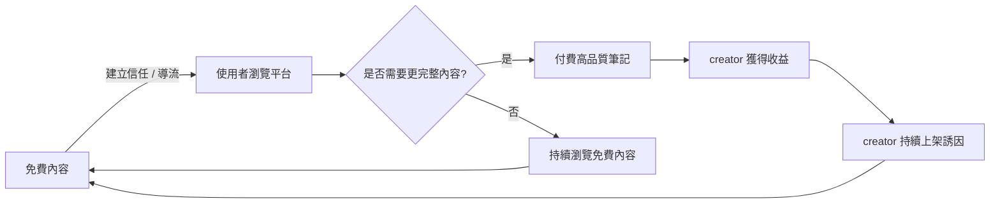

# 雙軌商業模式設計 Business Model Design

> 本文件為產品規劃期間的規格文件之一，完整專案背景請見[根目錄 README](../README.md)

## 背景與問題

本專案為教育內容電商，在冷啟動階段面臨一個典型的兩難：內容太少，平台缺乏吸引力，使用者不會來；但若一開始就要求所有內容付費，創作者上架意願低，內容成長速度太慢，平台會陷入「沒有內容→沒有流量→沒有創作者」的惡性循環。

在資源有限、必須以低成本快速驗證市場需求的前提下，需要一個能同時解決「內容成長」與「營收驗證」這兩個目標的商業模式，而不是只能二選一。

## 目標與成功指標

- **流量目標**：透過免費內容降低使用門檻，加速累積使用者基數與內容庫存量
- **營收目標**：驗證使用者是否願意為「高品質」內容付費，確認付費內容的定價與品質標準是否成立
- **平衡指標**：免費與付費內容的比例、付費內容轉換率。即持有免費內容的買家，是否有意願在看完免費筆記後，更進一步付費購買付費筆記。以此作為後續調整內容策略的依據

## 使用者情境

> 作為一位剛開始使用這個平台的學生，我希望能先免費瀏覽部分筆記內容，確認品質與適用性後，再決定是否付費購買更完整或更高品質的教材，以便在購買前建立對平台的信任。

> 作為一位內容創作者，我希望能有免費導流的功能使用，讓外部使用者可以更快認識我，並且決定哪些作為高品質付費商品取得收益，以便在推廣自己的知名度與實際獲得收益之間取得平衡。

## 規格邏輯

雙軌模式並非單純把內容分成「免費」與「付費」兩類，而是讓兩者在使用者旅程中扮演不同角色、互相帶動：

- **免費內容**：定位為「導流與信任建立」，品質門檻較低，目的是讓使用者在不需承擔風險的情況下體驗平台價值(包含筆記內容和獨家開發的閱讀器)
- **付費內容**：定位為「主要營收來源」，品質門檻較高，透過免費內容建立的信任作為轉換基礎
- 兩者形成循環：免費內容帶來使用者，使用者中的一部分轉換為付費，付費帶來的收益回饋創作者，創作者持續產出（包含免費）內容，維持循環運作

## 取捨與限制

- **曾考慮的替代方案**：完全免費（純流量導向，靠廣告或其他變現方式）——捨棄原因是團隊資源有限，無法同時經營流量規模與廣告變現兩條線，且教育內容的付費意願本身就是這次 MVP 最需要驗證的核心假設之一，若不設計付費機制，就無法驗證這個假設。
- **曾考慮的替代方案**：完全付費（所有內容皆需購買）——捨棄原因是冷啟動階段平台尚無足夠內容與信任基礎，過高的進入門檻會導致使用者在還不了解平台價值前就流失。
- **已知限制**：即便有免費內容，目前帳號創建的成長速度沒有提升，導致推廣還是普遍困難。當時朝以下方向討論：
    (1)降低帳號創建門檻，無須強迫使用line綁定
    (2)建立講師免費筆記推廣頁面，提供即時掃QRcode並快速取得筆記的方式，讓講師可以在講座結束時供聽者迅速取得筆記
